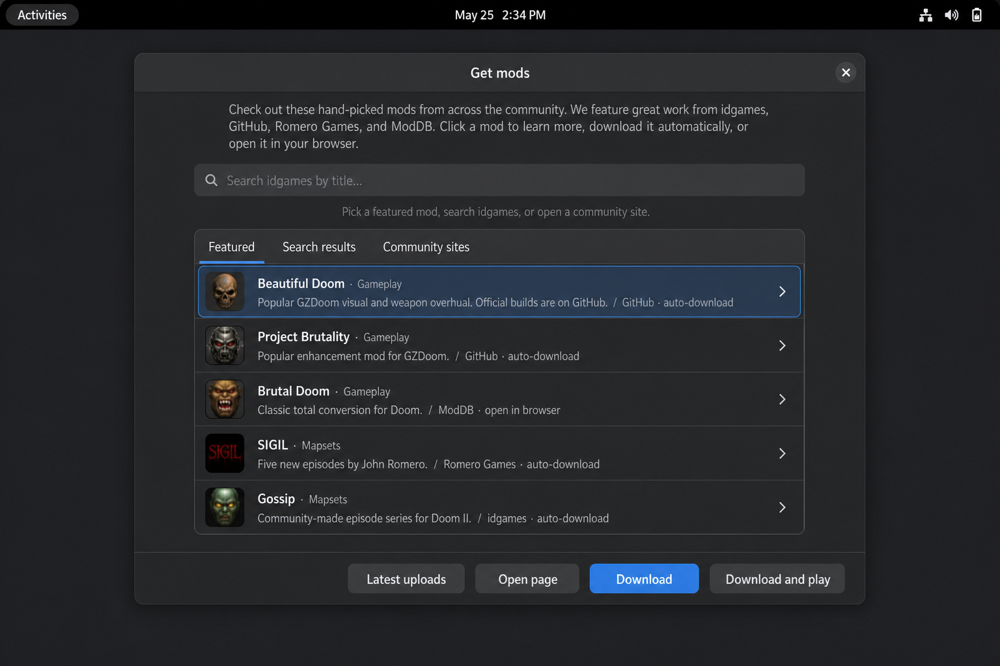
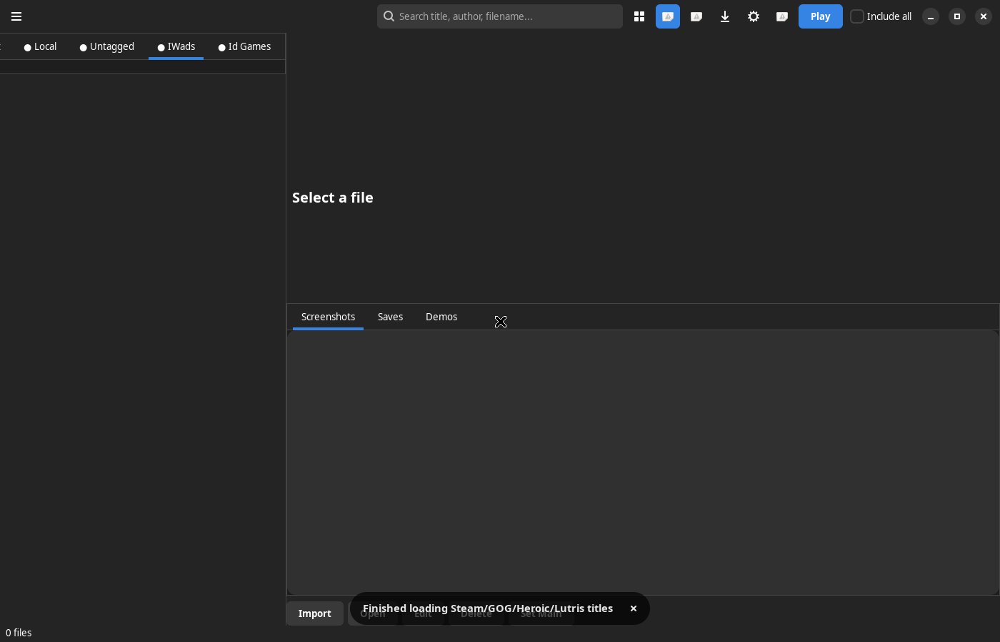

= Doom Launcher — DoomedLauncherNix

_A Linux-focused fork of https://github.com/nstlaurent/DoomLauncher[Doom Launcher] by
**Hobomaster22** (https://github.com/nstlaurent[@nstlaurent])._

[IMPORTANT]
====
*This repository is a fork.* It is not the official Doom Launcher project.

* *Original project:* https://github.com/nstlaurent/DoomLauncher[nstlaurent/DoomLauncher] — created and maintained by Hobomaster22 (https://github.com/nstlaurent[@nstlaurent]), licensed https://www.gnu.org/licenses/gpl-3.0.html[GPL-3.0-or-later].
* *This fork:* https://github.com/goshitsarch-eng/DoomedLauncherNix[goshitsarch-eng/DoomedLauncherNix], maintained by Gosh Apps.
* *Forked at:* upstream commit `473441a` (18 June 2026).
* *Why:* to add a native Linux frontend (GTK 4 + libadwaita) and a Flatpak build. See <<what-this-fork-adds>>.

Please send *Windows* bug reports and feature requests to the
https://github.com/nstlaurent/DoomLauncher/issues[upstream issue tracker], not here.
See <<contributing>>.
====

Doom Launcher is a _Doom_ frontend and wad library. Instead of being a
simple utility to launch your files, it serves as a database for all your
_Doom_ engine games and mods. It can be compared to https://www.quaddicted.com/tools/quake_injector[Quake Injector],
a popular tool for _Quake_.

Windows uses the original WinForms app, unchanged from upstream. Linux uses a
GTK 4 + libadwaita frontend added by this fork, which can also run as a Flatpak.


*Get mods* on Linux: featured downloads from idgames, GitHub, Romero Games, plus community sites such as ModDB when a direct zip is not available.


The GTK 4 + libadwaita main window. Setup assistant, Get mods, downloads, and Play sit in the header; IWADs and the Id Games tab are in the sidebar.

image::https://i.imgur.com/TIg4kNK.png[IWads Tile View Showcase]
Large tile view for IWads tab. IWADs such as _Freedoom_ and _Heretic_ can be played with Doom Launcher.

image::https://i.imgur.com/mYqC1QO.png[Custom Files Tile View Showcase]
Large tile view for a custom tag named "Playing". Doom Launcher can play custom mapsets such as Eviternity, Back to Saturn X, Plutonia 2, and more!

== Features

These come from the original Doom Launcher and work on both platforms unless noted.

* Direct download and metadata update from /idgames (through API).
* Featured auto-downloads from GitHub (Beautiful Doom, Project Brutality, Freedoom) and official Romero SIGIL zips; ModDB and other hubs as open-in-browser links.
* Add ZIP archives containing WAD/PK3/DEH/TXT files.
* Automatic scraping of title, author, release date and description
from included text files.
* Automatically load files when selecting an IWAD or source port.
* Add comments and ratings for files.
* Import screenshots directly from a source port into the database.
* Maintain demos and saved games (DSG/ZDS supported).
* Set launch parameters and warp into any map in a file.
* Select specific files within a ZIP archive.
* Tag files with custom colored tags.
* Screen filters to simulate CRT monitors (Windows play overlay).
* Record play-statistics for each map completed in a play session.
Supported source ports includes ZDoom, PrBoom+, CNDoom, Chocolate Doom,
and Crispy Doom.
* Automatic daily database backups (SQLite database files).
* Create shortcuts to quickly launch files.

Many more features are documented in the Help file. Please read it if
you have any concerns regarding certain features.

[[what-this-fork-adds]]
== What this fork adds

Everything below is new work in this fork; none of it exists upstream.

* A native *GTK 4 + libadwaita* frontend (`src/DoomLauncher.Gtk`) with feature parity for the library, play, download, tag, settings, and archive surfaces.
* A *.NET 8* port of the shared launcher code (`src/DoomLauncher.Core`), replacing Windows-only pieces: `Microsoft.Data.Sqlite` for `System.Data.SQLite`, SharpCompress for SevenZipSharp, ImageSharp for `System.Drawing`.
* A *Flatpak* manifest and AppStream metadata (`flatpak/`), including running correctly when the launcher itself is sandboxed.
* *Source port detection* for native binaries, AppImages, Flatpaks, and snaps, including GZDoom, UZDoom, VKDoom, and others.
* A *first-run setup assistant*: install GZDoom, import IWADs from Steam/GOG/Heroic/Lutris or Freedoom, and download mods.
* A *ported test suite* (`src/DoomLauncher.Core.Tests`) that runs on Linux.

See link:LINUX.md[LINUX.md] for the full Linux documentation.

== Relationship to the original project

This fork is deliberately additive. Of the files inherited from upstream at the
fork point, only four have been modified, and all four are documentation or build
configuration — no upstream source file has been changed:

[cols="1,3"]
|===
| File | Change

| `README.adoc`
| Rewritten for this fork (the document you are reading).

| `THIRD-PARTY-NOTICES.md`
| Extended to cover the Linux stack's dependencies and the bundled Windows controls.

| `RELEASENOTES.md`
| Fork release notes added above upstream's, which are reproduced unchanged.

| `.gitignore`
| Added ignores for .NET 8 / Flatpak build output.
|===

Everything else this fork contributes is *new files* under `src/`, `flatpak/`,
`docs/`, `LINUX.md`, and `DoomLauncher.Linux.sln`. In particular:

* The Windows WinForms application (`DoomLauncher/`) is upstream's code, unmodified — not one `.cs` file touched.
* `DoomLauncher.sln` — the Windows solution — is upstream's, unmodified.
* Upstream improvements can therefore be merged into this fork with little friction, and the Linux work could be offered upstream as an addition rather than a rewrite.

You can check this claim yourself:

```bash
git diff --diff-filter=M --name-only 473441a HEAD
```

As required by the GPL, this is a modified version of Doom Launcher; the
modifications described above were made by Gosh Apps in August 2026
and are documented in link:RELEASENOTES.md[RELEASENOTES.md] and the commit history.

== Linux (GTK 4)

See link:LINUX.md[LINUX.md] for the GTK frontend, Flatpak notes, and source-port setup.

```bash
sudo apt install dotnet-sdk-8.0 libgtk-4-1 libadwaita-1-0
dotnet build DoomLauncher.Linux.sln
dotnet run --project src/DoomLauncher.Gtk/DoomLauncher.Gtk.csproj
```

Run the tests:

```bash
dotnet test src/DoomLauncher.Core.Tests/DoomLauncher.Core.Tests.csproj
```

To install as a Flatpak from this tree:

```bash
flatpak-builder --user --install --force-clean build-dir flatpak/com.goshapps.DoomLauncher.yml
flatpak run com.goshapps.DoomLauncher
```

== Building on Windows

The Windows build is unchanged from upstream. Download a copy of the repository
onto your Windows system and open up the solution file on Visual Studio. Visual
Studio 2017 or later is recommended. You may create new unit tests to help verify
that your changes work before submitting them.

Doom Launcher currently supports Windows 7 and later. Linux is supported
through `DoomLauncher.Linux.sln` as described above.

In order to build the Setup module for Visual Studio 2022, you may need to separately install
support for Installer projects:
https://marketplace.visualstudio.com/items?itemName=VisualStudioClient.MicrosoftVisualStudio2022InstallerProjects

Doom Launcher is written in C#. The Windows UI requires .NET Framework 4.8.
The Linux UI requires .NET 8, GTK 4, and libadwaita.

[[contributing]]
== Contributing and reporting bugs

Please file where the code lives, so the right maintainer sees it:

[cols="2,3"]
|===
| Topic | Where

| Linux, GTK frontend, Flatpak, source port detection, `src/**`
| https://github.com/goshitsarch-eng/DoomedLauncherNix/issues[This fork's issue tracker]

| Windows WinForms app, core launcher behaviour, anything reproducible on upstream
| https://github.com/nstlaurent/DoomLauncher/issues[Upstream issue tracker]

| Not sure
| Open it here and it will be redirected if it belongs upstream
|===

To contribute to this fork, fork a copy of the repository and submit your changes
via a pull request. Changes that are not Linux-specific are usually better sent
upstream first, so that everyone benefits and this fork stays a thin addition.

== Development Tools

SQLite Browser. Great tool for viewing and editing the DoomLauncher.sqlite database:
https://sqlitebrowser.org/

SonarLint. A great code analysis extension for Visual Studio. Highly recommended and used for most of Doom Launcher's development:
https://www.sonarlint.org/visualstudio/

== Credits

*Doom Launcher* was created and is maintained by *Hobomaster22*
(https://github.com/nstlaurent[@nstlaurent]),
with contributions from the upstream project's contributors. This fork exists only
because that work was shared under a free licence — please support the original
project first.

Upstream project links:

* GitHub repository: https://github.com/nstlaurent/DoomLauncher
* Doomworld thread: https://www.doomworld.com/vb/doom-general/69346-doom-launcher-doom-frontend-database/
* Realm667: https://realm667.com/index.php/en/kunena/doom-launcher
* Upstream build status: https://ci.appveyor.com/project/hobomaster22/doomlauncher[image:https://ci.appveyor.com/api/projects/status/github/nstlaurent/doomlauncher?svg=true[Build status]] (AppVeyor, upstream repository)
* Upstream code quality: image:https://api.codacy.com/project/badge/Grade/f77deda96cfb4b90a201d09cb0014009[link="https://app.codacy.com/manual/nstlaurent/DoomLauncher?utm_source=github.com&utm_medium=referral&utm_content=nstlaurent/DoomLauncher&utm_campaign=Badge_Grade_Settings"] (Codacy, upstream repository)

The Linux frontend stands on other people's work too — GTK, libadwaita, gir.core,
ImageSharp, SharpCompress, SQLite and more. Every bundled and referenced project is
credited in link:THIRD-PARTY-NOTICES.md[THIRD-PARTY-NOTICES.md].

Doom and the Doom engine are the work of id Software. Doom Launcher is an
independent tool and is not affiliated with, endorsed by, or supported by
id Software or ZeniMax.

== License

Doom Launcher is licensed under the *GNU General Public License v3.0 or later*.
The full text is in link:LICENSE[LICENSE], and it applies to this fork as it does
to the original.

Third-party components are covered by their own licences, reproduced in
link:THIRD-PARTY-NOTICES.md[THIRD-PARTY-NOTICES.md].
